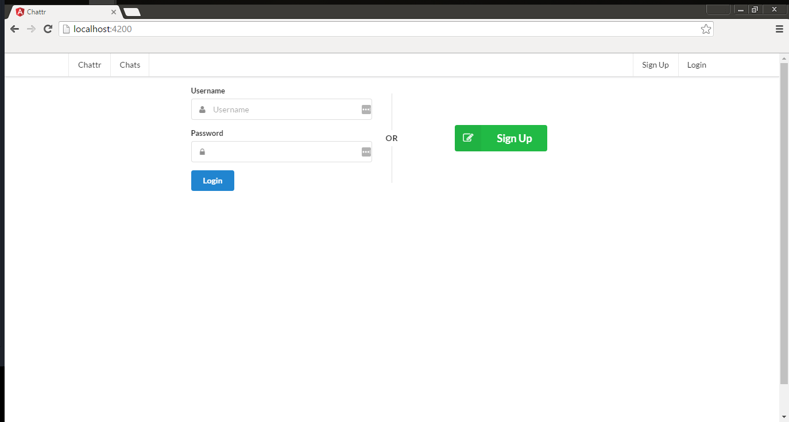
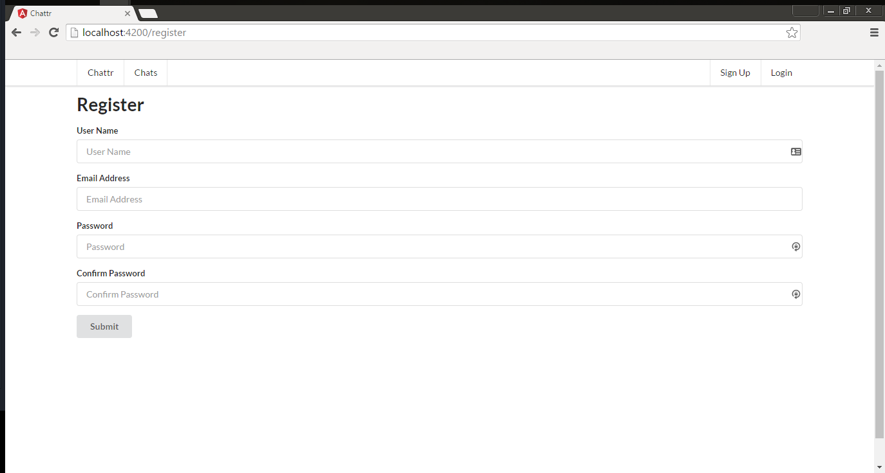
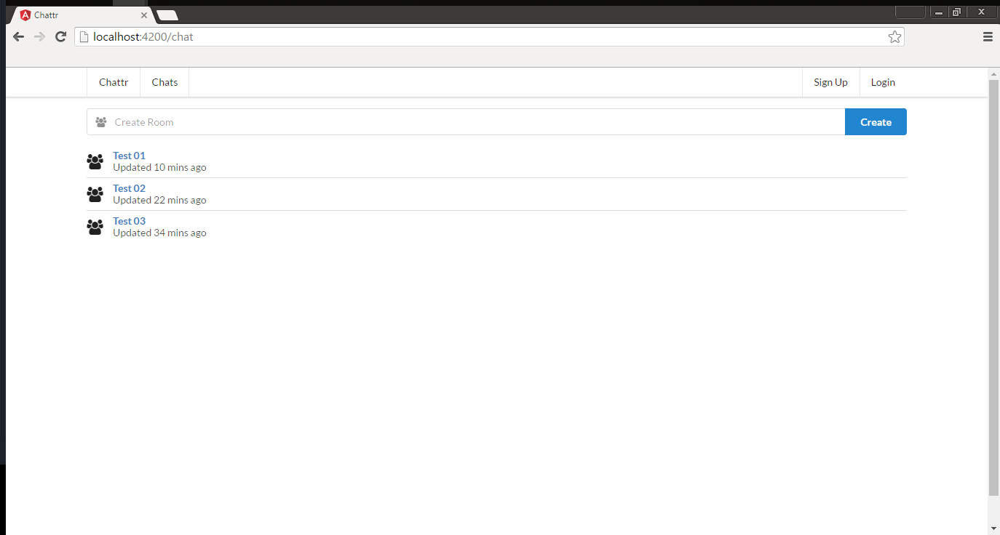
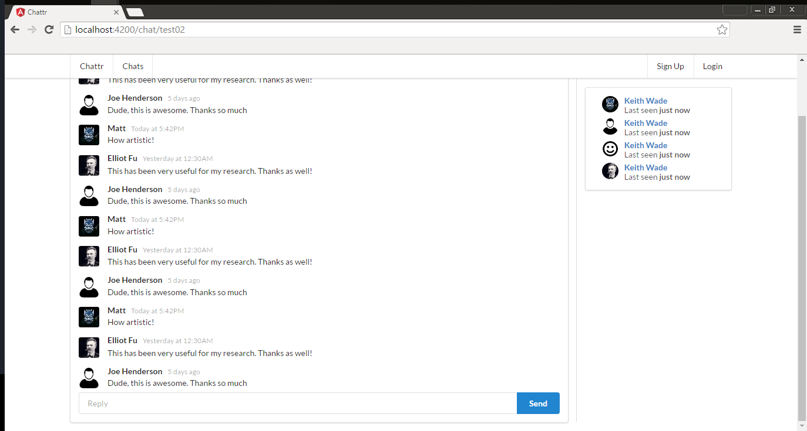

# chattr-front

This is the frontend sockets and database solution for chattr. The backend solution's code is located [here](https://github.com/keawade/chattr-back).

## Technologies

- [Angular 2](https://angular.io/)
- [Semantic UI](http://semantic-ui.com/)
- [Socket.io](http://socket.io/)

## Preview

### Home / Login

### Register

### Chat List

### Chat Rooms

## Installation

1. Run `npm install`.
2. Run `npm start`
